# Folio

**The vibe-coded, open-source alternative to Notion and Confluence.**
Your team's wiki lives in Git. People write in the browser, together, in real
time. AI agents read and write the same pages. One command to run it yourself.

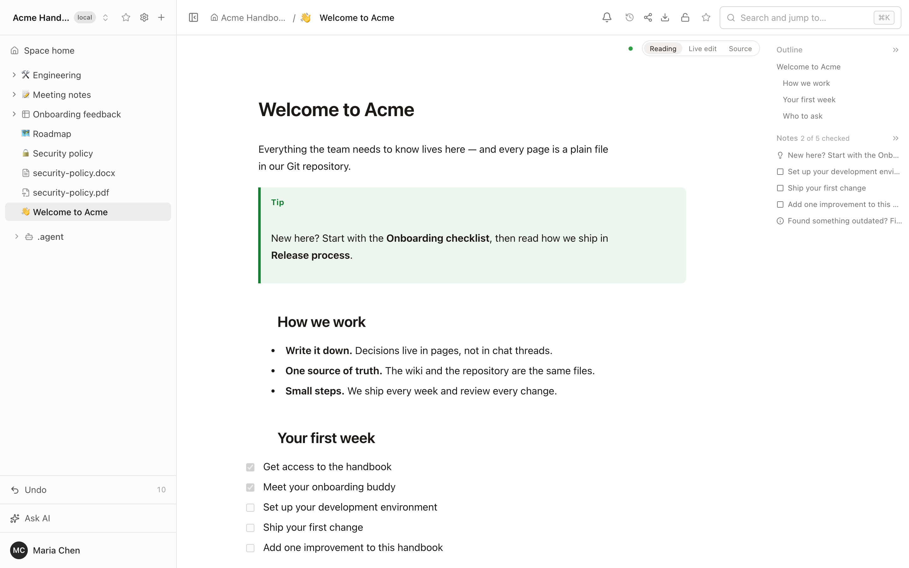

Folio was built to replace Confluence and Notion for a real team — and it was
built by AI agents, in the open. The plans, specs and hand-off notes the agents
work from are in this repository, next to the code they wrote.
[More on that below.](#vibe-coded-and-not-hiding-it)

```bash
git clone https://github.com/evergreen-it-dev/folio.git
cd folio
docker compose up -d
```

Open <http://localhost:4870>, create the first account, start writing.

---

## Why Folio

- **You own the content.** Every page is a plain file in a Git repository you
  control. No export step, no lock-in: stop using Folio tomorrow and the files
  are still there, readable in any editor.
- **It works the way a wiki should.** Real-time editing, a page tree, search,
  access rights, history, sharing — and it keeps working offline.
- **Agents are first-class users.** Not a chatbot bolted on the side: a
  built-in assistant, your own agent in every space, a full MCP server, and
  Markdown links made for agents.
- **Documents, tables, whiteboards, diagrams and files in one tree.** A
  roadmap table next to the spec, next to the architecture board, next to the
  signed PDF.
- **One command to run.** Docker, and nothing to configure for a first start.

---

## Git-first, all the way down

Most wikis keep your content in a database and offer Git as an export. Folio
does the opposite: **the Git repository is the wiki**. The database holds the
index, access rights and the state of live editing — never the only copy of
your words.

This is what a space looks like on disk:

```text
acme-handbook/
├── index.md
├── welcome-to-acme.md
├── engineering.md
├── engineering/
│   ├── onboarding-checklist.md
│   ├── release-process.md
│   ├── incident-runbook.md
│   └── how-folio-fits-together.excalidraw.svg    ← a whiteboard
├── meeting-notes.md
├── meeting-notes/
│   └── product-sync-september-28.md
├── roadmap.table.md                               ← a data table
├── onboarding-feedback.table.md
├── onboarding-feedback/
│   └── onboarding-feedback.form.md                ← a form
├── security-policy.md
├── security-policy.pdf                            ← files are pages too
└── security-policy.docx
```

And this is its history — ordinary commits, with the people who made the
changes as authors:

```text
$ git log --format='%h  %an  %s'
be529a0  Maria Chen  folio:update
aeac3bb  Maria Chen  folio:update
6c2c061  Sam Rivera  folio:update
026d9ec  Maria Chen  folio:update
...
4e9ec49  Folio       init: create space
```

What that gives you:

- **Edit anywhere.** Change a page in the browser or in your IDE and push —
  both land in the same history. Links between pages are ordinary relative
  Markdown links, not a private dialect.
- **Bring your own repository.** Start with an empty space, clone an existing
  repository, or connect one later. Several spaces can share one repository,
  each in its own folder — so documentation can live right next to the code.
- **Review like code.** Merge requests, blame, diff and revert work on your
  wiki because it *is* a repository.
- **Nothing is lost quietly.** Sync state is always visible — clean, ahead,
  behind, conflict — and conflicts are listed for the whole space. "Take the
  version from Git" resets a space to the remote branch and saves what was
  there into a backup branch first.
- **Readable formats.** A whiteboard is an SVG that opens in any browser and
  still carries the editable scene. A data table is one Markdown file — the
  column types and saved views in the front matter, the rows as a table you
  can read:

```markdown
# Roadmap

| Initiative | Status | Owner | Team | Due | Effort, days | Urgent | id |
| --- | --- | --- | --- | --- | ---: | --- | --- |
| Single sign-on for enterprise plans | In progress | @alex | Engineering | 2026-10-09 | 8 | [x] | 1787nfg3 |
| New onboarding flow | In review | @sam | Design | 2026-10-02 | 5 | [ ] | b227mwwh |
| Pricing page redesign | Planned | @sam | Design | 2026-10-16 | 3 | [ ] | ndxvtpa3 |
```

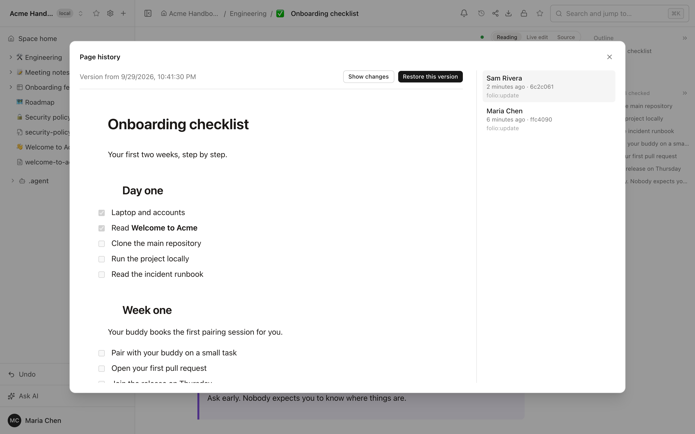

---

## Write together

Documents, data tables and whiteboards are edited by several people at once.
You see who is on the page and where their cursor is; changes appear as they
are typed. When the page goes quiet, Folio commits — with the person who
edited as the author.

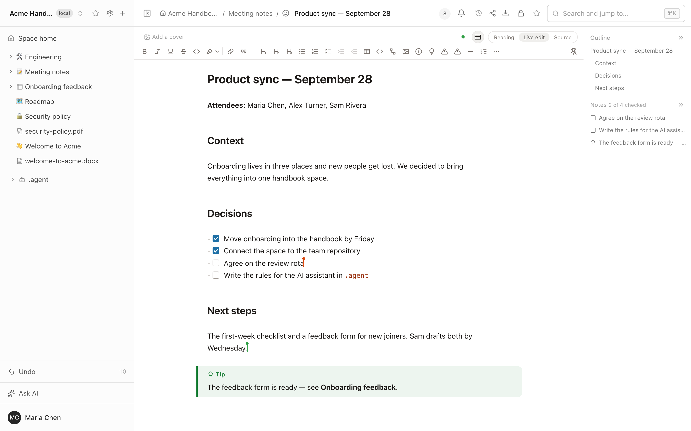

---

## Works offline

On a train, on a plane, on bad hotel Wi-Fi — keep writing.

- Pages and whiteboards you have opened stay editable without a connection.
- New pages and whiteboards can be created offline and appear in the tree
  straight away.
- Everything is kept on the device and reaches the server by itself when the
  connection returns — at the same address, with no duplicates.
- Nothing is lost if you switch pages or close the tab.
- An indicator in the header shows what is waiting to be sent.

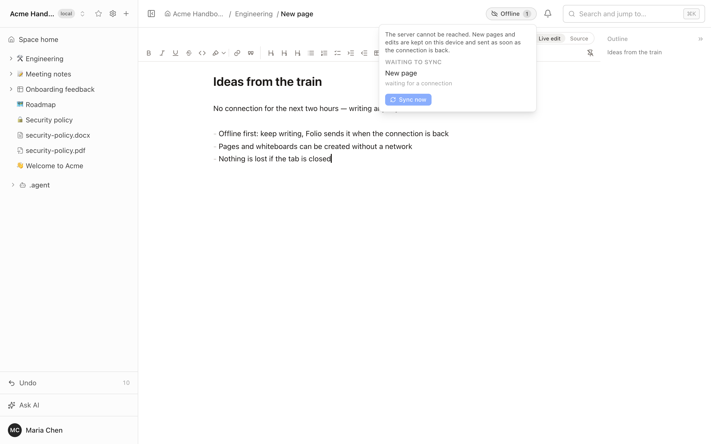

Data tables, forms and file uploads need a connection.

---

## Documents

A Markdown editor that does not make you think about Markdown. Three modes —
**Reading**, **Live edit** and **Source** — so that writers and engineers are
both at home.

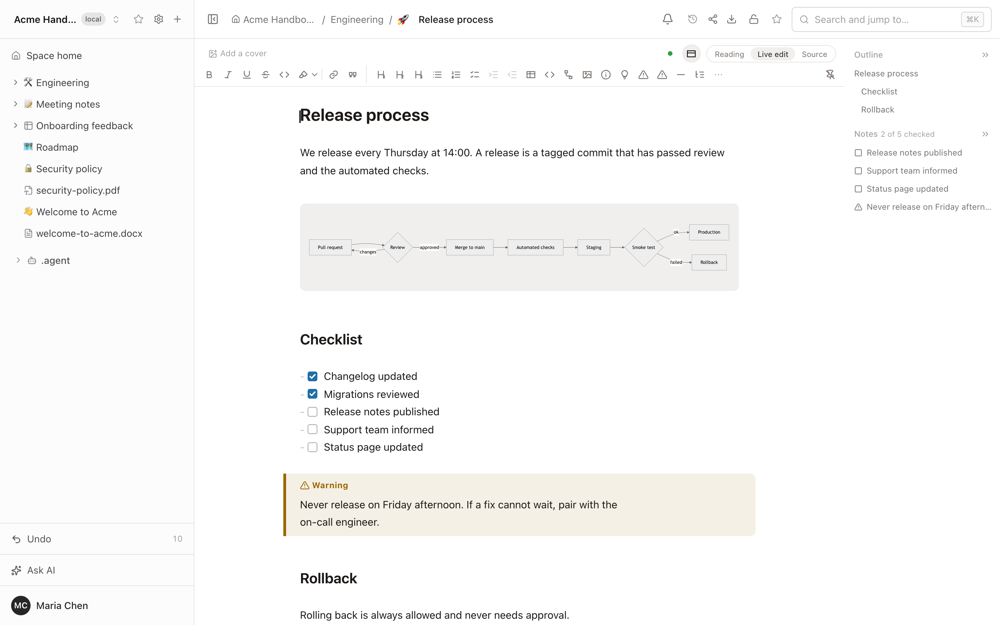

- Callouts, checklists, tables with merged cells and colors, code blocks,
  collapsible sections, highlights.
- Paste from Excel and Google Docs keeps tables and formatting.
- `[[` links a page, `@` mentions a person, `/` inserts anything.
- `::pagetree` puts a live tree of child pages right into the text.
- Outline and notes panel, backlinks, page icons and covers, templates,
  glossary terms with hover cards.
- Light and dark themes, following the system or chosen by hand.

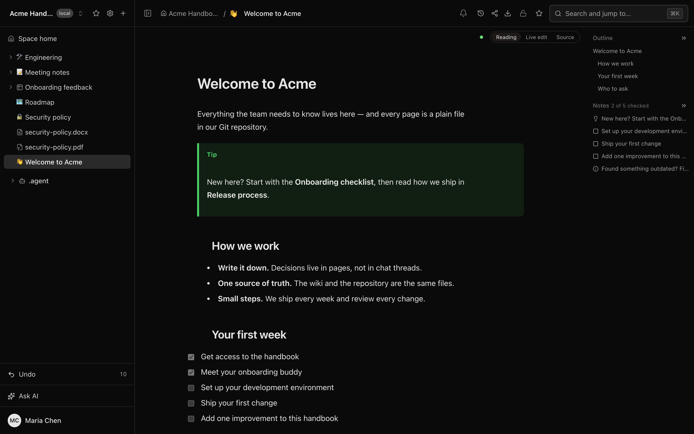

---

## Diagrams you draw, not type

Mermaid diagrams come with a visual editor. You build the diagram on a canvas,
and Folio writes the Mermaid code for you — or you type the code and watch the
canvas follow. Both sides stay in sync.

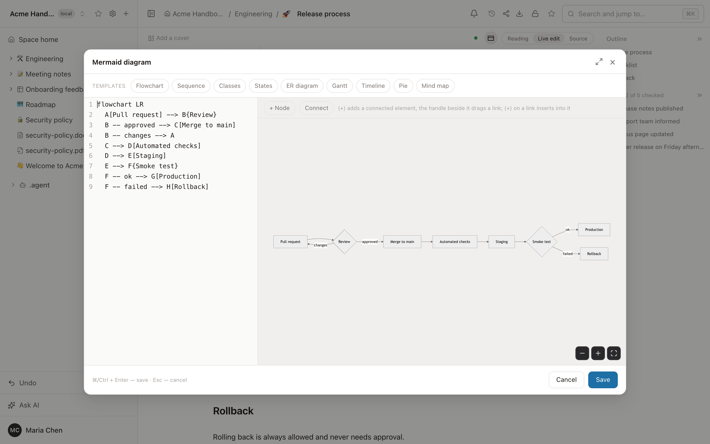

- **Click to build.** A plus on a node adds a connected one, a plus on a link
  inserts a node into it, a handle drags a new link from node to node.
- **Nine diagram types from templates**: flowchart, sequence, classes, states,
  ER, Gantt, timeline, pie, mind map.
- **Code and canvas side by side**, full screen when you need room, and a
  readable message instead of a broken picture when the syntax is wrong.
- **Still plain Markdown.** The diagram is stored as an ordinary `mermaid`
  code block, so GitHub and GitLab render it too.

---

## Data tables

Spreadsheets that belong to the wiki: typed columns, saved views, filters and
sorting — a small database you can link from any page and query from any
agent.

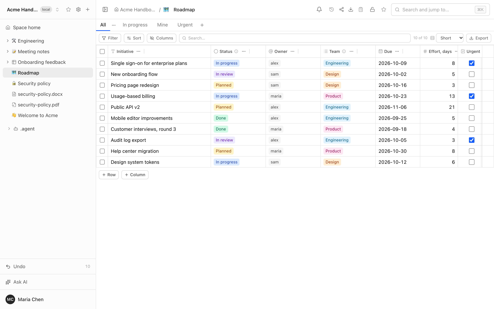

- Column types: text, long text, number, date, checkbox, select, status, user,
  link.
- Views as tabs, each with its own columns, order, widths, multi-column sort
  and `and`/`or` filters — including "me", "today", "this week".
- Edited together in real time, stored as one readable file in Git.
- Import and export; up to 20,000 rows per table.

**Forms** turn a table into a questionnaire: every answer becomes a row. A
form can be public, so people answer without an account.

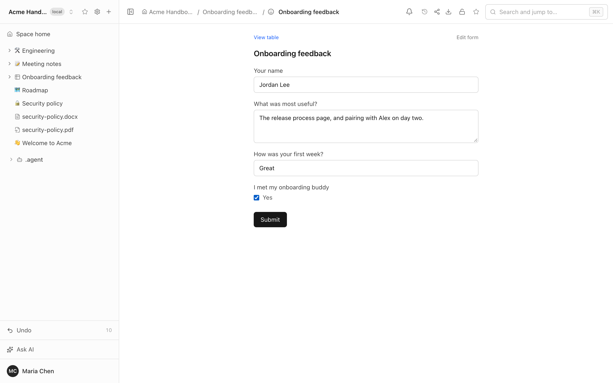

---

## Whiteboards

Excalidraw boards inside the wiki — architecture, flows, workshops. Drawn
together in real time and saved as SVG files that render anywhere.

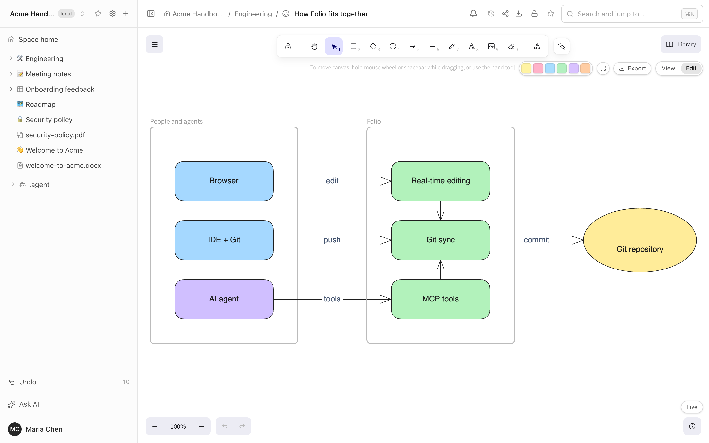

The board above was not drawn by hand. An agent created it through MCP from a
short description of boxes and arrows; people then keep editing it like any
other board.

---

## Document preview

PDF, Word, Excel and PowerPoint files are pages too. Drop one into the tree
and it opens right inside Folio — no download, no other application, no
conversion on the server.

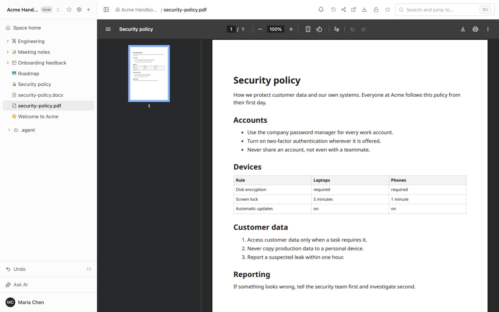

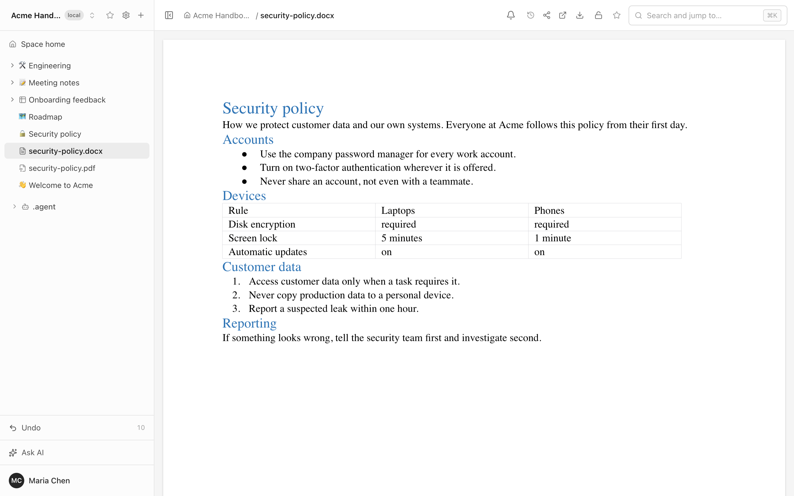

- **PDF** in the browser's own viewer: thumbnails, zoom, search, print.
- **Word, Excel and PowerPoint** rendered in the browser.
- The file sits in the space's Git repository next to the pages about it, in
  the same tree, under the same access rights.
- Open in a new tab or download with one click.
- Folio never rewrites your file: what you uploaded is byte for byte what is
  stored.

These files are for viewing: they are not edited in Folio, and search finds
them by title.

---

## Folio AI

An assistant in the side panel that works with your wiki, not next to it.

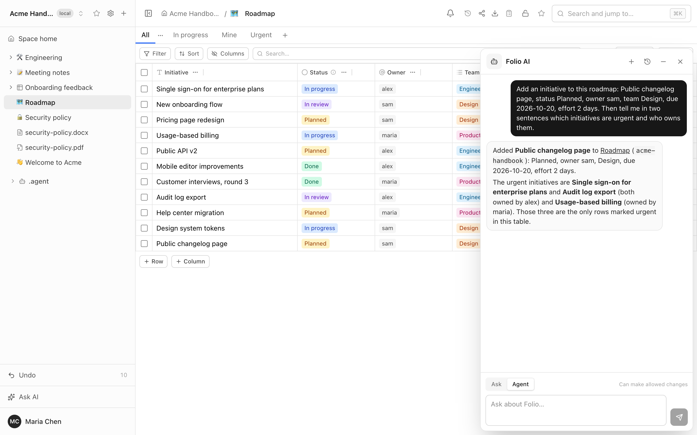

In the screenshot the assistant was asked to add an initiative to the roadmap
and say which ones are urgent. It read the table's schema, inserted the row —
it appears in the table on the left — and answered from the data.

- **Ask** — read-only. Find, summarize, compare, explain across the pages you
  have access to.
- **Agent** — reads and writes. Drafts a page, updates a table, draws a board,
  restructures a section — inside your rights, never beyond them.
- **Runs live on the server.** Close the browser and the work continues; come
  back and pick up where it was.
- **The same tools as everyone else.** The assistant works through the very
  tools an outside agent gets over MCP — there is no second, weaker
  implementation, and in Ask mode the write tools are switched off on the
  server, not just hidden.

### Your own agent in every space: `.agent`

Every space has a `.agent` folder. Whatever you put there becomes the
assistant's instructions **for that space** — and it is written as ordinary
Folio pages, not as configuration.

- **Build an agent by writing pages.** Its role, its tone, the glossary, the
  rules it must follow, the templates it should use, the process it should
  walk people through.
- **A different agent for every team.** The support space gets an agent that
  answers like support. The engineering space gets one that knows the release
  process. Legal gets one that never improvises. Same Folio, different
  agents.
- **Versioned like everything else.** The instructions live in Git: you can
  see who changed the agent's behavior, review the change, and roll it back.
- **Owned by administrators.** Only space administrators see and edit
  `.agent`; everyone else just gets a better assistant.

The instructions apply to every run in the space, in Ask and Agent modes
alike.

### Bring your own subscription

Folio does not resell AI and does not mark it up. You connect the
subscription you already pay for, and the assistant runs on it.

| Provider | Status |
|---|---|
| Cursor | **available** — each person connects their own key, or the operator sets one for everyone |
| Others | coming soon |

Without a subscription everything else in Folio works as usual.

---

## Built for agents

**MCP server.** 21 tools over `/mcp` with personal access tokens: list and
search spaces, read and write pages, create and edit whiteboards, query and
update data tables, read history.

```bash
claude mcp add folio --transport http https://wiki.example.com/mcp \
  --header "Authorization: Bearer folio_pat_…"
```

**Markdown for an agent.** Any page — with its child pages, if you want — is
one link that returns clean Markdown. No scraping, no HTML, no login flow:

```bash
curl https://wiki.example.com/share/<token>.md
```

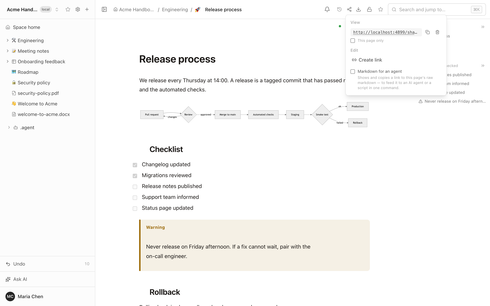

**Export in the formats agents and people need**: Markdown, YAML, PDF, DOCX,
or a zip of a whole space.

**Safe by design.** A token never has more rights than its owner, a `read`
token cannot write, and administrative actions are not available to tokens at
all. Details: [docs/MCP.md](docs/MCP.md).

---

## Moving from Confluence

Point Folio at a Confluence page or a whole tree and it brings the pages over
as Markdown — with images, code, checklists, and panels converted into
callouts. Pages come from Confluence Cloud and from on-premises
installations; whiteboards from Confluence Cloud become Excalidraw boards.

Run a test import first: not every macro has an equivalent.
[What is not there yet](docs/LIMITATIONS.md) is written down honestly.

---

## Access management

Who sees what is decided in one place, and it is visible at a glance.

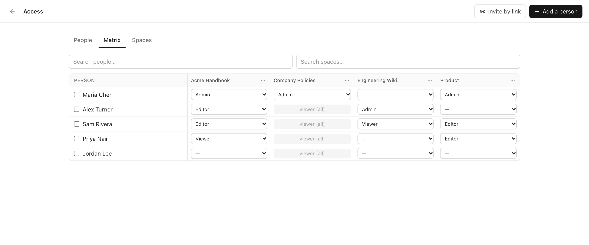

- **Roles per space**: administrator, editor, viewer.
- **Private or open spaces.** A private space is visible to its members only.
  A space open to the instance gives everyone read access, and edit rights
  still have to be granted.
- **The access matrix.** People down the side, spaces across the top, a role
  in every cell. Change one cell or many at once.
- **An administrator is not a reader.** The instance administrator manages
  people and access but does not see the content of a private space they are
  not a member of. They can grant access to themselves — and that is written
  to the audit log and marked for everyone to see.
- **Audit log.** Every grant, revoke and visibility change is recorded with
  who did it and when.

**Page-level access.** Any page can be narrower than its space: open to all
members, to you only, or to selected people with view or edit rights.

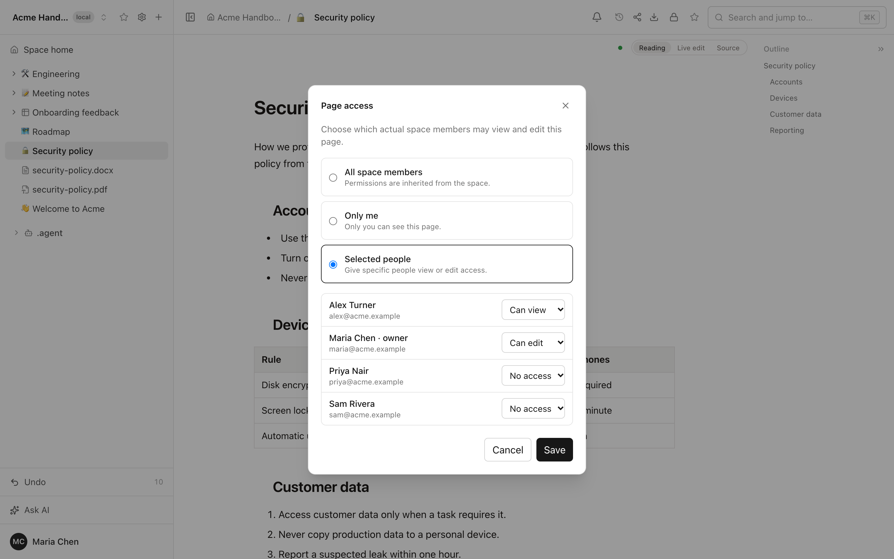

**Getting people in**

- **Invitations by link** with preset spaces and roles, an expiry date and a
  usage limit.
- **Access requests.** Someone who opens a space they cannot see can ask for
  access; administrators are notified at once and choose the role.
- **Sign in with Google**, limited to the email domains you list. A new
  person gets an account and no access until someone grants it.
- **Deactivate** an account without deleting what the person wrote.

**Sharing outside**

- Share links for people without an account: view or edit, one page or a
  whole subtree (pages with their own access restrictions are left out),
  revocable at any time.
- Forms that accept answers without an account.

**For agents and scripts**

- Personal access tokens with `read` or `write` scope. A token never has more
  rights than its owner, and administrative actions are not available to
  tokens at all.
- The `.agent` folder is visible to space administrators only.

---

## Run it

You need [Docker](https://docs.docker.com/get-docker/) and
[Git](https://git-scm.com/downloads). Nothing else.

```bash
git clone https://github.com/evergreen-it-dev/folio.git
cd folio
docker compose up -d
```

The first start builds the application and takes a few minutes. Then open
<http://localhost:4870> and create the first account — it becomes the
administrator.

A short welcome takes it from there: pick what to create first — a document,
a whiteboard or a data table — look through what Folio can do, and land in
your first space with that page open. Connecting an existing Git repository
is one link away on the same screen.

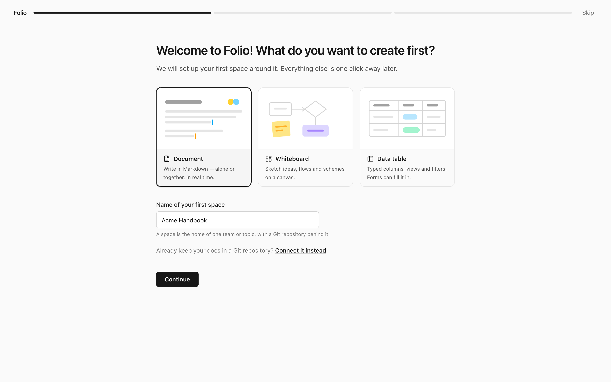

| Where | How |
|---|---|
| Your computer | `docker compose up -d` |
| A server or VPS | the same, plus `--profile https` for automatic HTTPS |
| Container platforms (Railway, Render, Fly.io, Coolify and similar) | from the `Dockerfile`, with PostgreSQL, Redis and a persistent volume — see [requirements](docs/INSTALL.md#other-platforms) |
| Vercel, Netlify and other serverless hosting | not supported — Folio is a long-running server that keeps Git repositories on disk and holds live connections |

Domains, HTTPS, updates and backups: [docs/INSTALL.md](docs/INSTALL.md).

---

## Vibe-coded, and not hiding it

Folio is written by AI coding agents. A human product owner decides what to
build, tries every change in the browser and decides what ships; agents plan
the work, write the code and the tests, and document what they did.

From the first commit on August 21, 2026 to version 0.1.0 on September 29,
2026: 39 days, more than 400 commits upstream, roughly 90,000 lines of
TypeScript and another 50,000 lines of tests. It runs in production for a real
team.

We publish how it is made, not only what was made:

| File | What it is |
|---|---|
| [AGENTS.md](AGENTS.md) | How the work is organized and the rules agents follow in this repository |
| [docs/HANDOFF.md](docs/HANDOFF.md) | The current state: how Folio is put together, what must never break, what is open, and the lessons that cost us something to learn |
| [DEV-PLAN.md](DEV-PLAN.md) | What has been built, in the order it was built, and what comes next |

If you are building with agents yourself, this repository is a worked example
of a non-trivial product made that way. If you only want a wiki, none of it
gets in your way.

---

## Documentation

- [Installation, HTTPS, updates, backups](docs/INSTALL.md)
- [Features](docs/FEATURES.md)
- [What is not there yet](docs/LIMITATIONS.md)
- [MCP and REST for agents](docs/MCP.md)
- [Changelog](CHANGELOG.md)

## Development

```bash
cp .env.dev.example .env
docker compose -f docker-compose.dev.yml up -d   # PostgreSQL, Redis, MinIO
npm install
npm run dev                                      # http://localhost:4871
```

Node.js 22 or newer (22.13 or newer for the assistant). See
[CONTRIBUTING.md](CONTRIBUTING.md) — and [AGENTS.md](AGENTS.md) if your
contributor is an agent.

## Help and security

Questions and bug reports: [SUPPORT.md](SUPPORT.md). Please report
vulnerabilities privately, as described in [SECURITY.md](SECURITY.md).

## License

[MIT](LICENSE)
